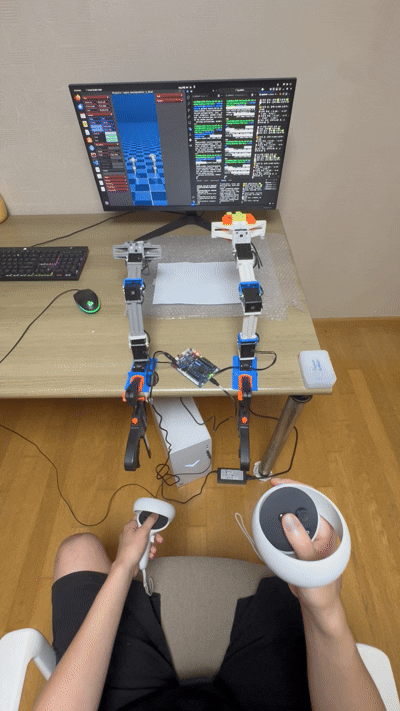

# 2025 한이음 공모전 CookingBot

## Meta Quest 2 VR → OpenManipulator-X Teleoperation


*Meta Quest 2 VR 컨트롤러로 OpenManipulator-X 로봇을 실시간 제어하는 모습*

---

## 프로젝트 개요

본 프로젝트는 Meta Quest 2 VR 헤드셋을 활용하여 OpenManipulator-X 로봇을 직관적으로 제어하는 텔레오퍼레이션 시스템을 개발했습니다. 

사용자가 VR 공간에서 자연스럽게 손을 움직이면, 실제 로봇이 동일한 동작을 수행합니다. 

기존의 복잡한 역기구학(IK) 해법 대신 혁신적인 **Offset-based Control** 방식을 도입하여, 더 안전하고 직관적인 로봇 제어를 구현했습니다.

궁극적인 목표는 듀얼암 로봇 시스템으로 확장하여 샌드위치 제작과 같은 협업 요리 작업을 수행하는 것입니다.

## 시스템 아키텍처

```
Meta Quest 2 (VR) → Docker (ROS1 + quest2ros) → Host (ROS2) → Physical Robot
                                  ↓
                             MuJoCo Simulation (verification)
```

---

## Dual Arm 제어 성공



양팔 로봇 동시 제어 구현을 성공했고 앞으로는 움직임 개선 및 통신 문제 해결할 예정입니다.


도커허브 mjo035에 image있고 docker폴더에 설치방법대로 하시면 됩니다

docker컨테이너 실행후 메타퀘스트 연결후 dual_arm_bridge_improved.py (vr_teleoperation 폴더 -> dual_arm폴더에 있습니다)
저장 후 실행

mujoco_mirror.py(무주코 파일) mirror_dual_last.py(미러링 코드) vr폴더 - dual_arm폴더에 있습니다

도커에서 브릿지 파일 실행한 상태에서 호스트에서 무주코 파일 실행시켜 텔레오퍼레이션 확인 및 캘리브레이션 시켜 초기자세 확인

vr_teleoperation 폴더에서 HARDWARE_SETUP_Guide.md대로 세팅 후 하드웨어 연결 실행 -> 초기자세로 잡아둔 후 연결코드 실행하셔야 됩니다 초기자세는 무주코에서 ab버튼 눌러서 캘리브레이션 시킨
자세대로 해주시면 됩니다.

하드웨어 연결해둔 상태에서 무주코 보면서 양팔 캘리브레이션 해서 무주코에서 초기자세인거 확인 후 메타퀘스트 움직이지말고 그대로 미러링코드 실행하시면 됩니다
그리퍼는 a버튼이었나 버튼 한개만 누르시면 닫히는데 하드웨어적으로 뻑뻑해서 닫히고 안열립니다... 

다 하시고는 미러링코드 부터 끄고 런치파일 종료하시면 됩니다 런치파일 종료하면 순간적으로 토크 풀려서 로봇팔 잡은상태로 끄셔야합ㅂ니다
